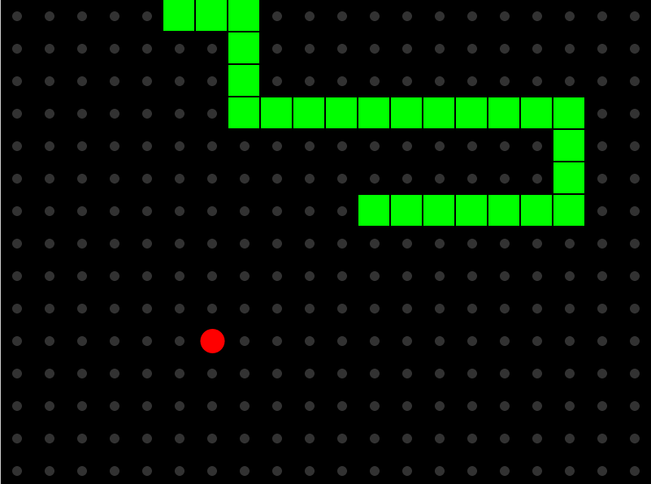

Simple snake game created in Falang that runs on stm32 Discovery board (Rust) and in browser.

[Video example](https://www.youtube.com/watch?v=-OPhNlZsEWo)

[Try online](https://falang-io.github.io/example-snake/code/ts/public/index.html)
  

To download falang ide: [https://falang.io](https://falang.io)

To build code run File -> "Build code" in application

Для генерации когда нажмите Файл -> "Сгенерировать код" в приложении

Discovery board version: STM32F429I-DISC1 

Rust:
  Directory: code/rust
  Command: cargo build

TypeScript:
  Directory: code/ts
  Command: npm install && npm start

